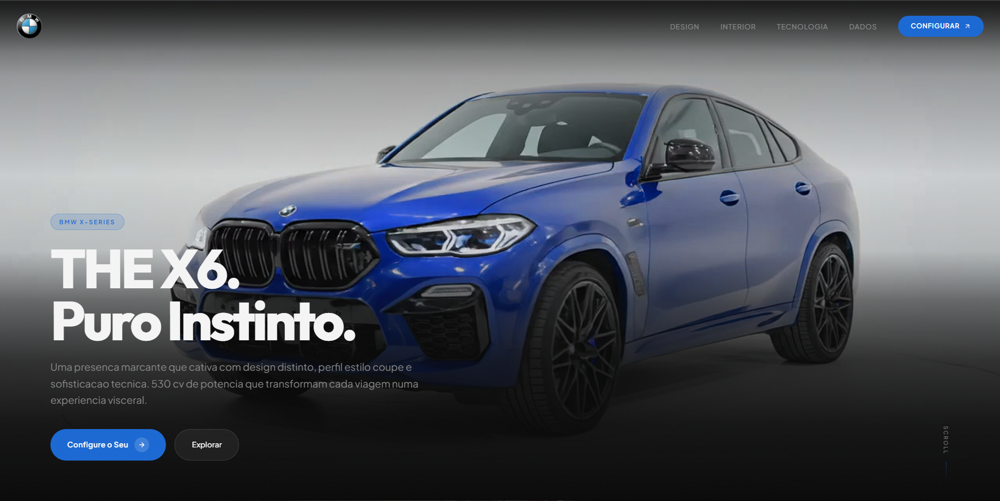
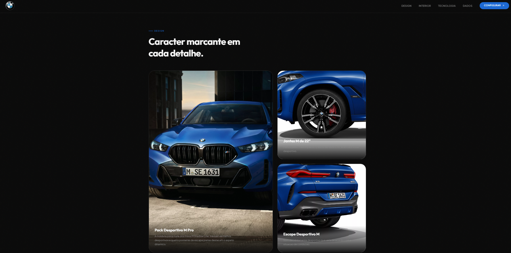
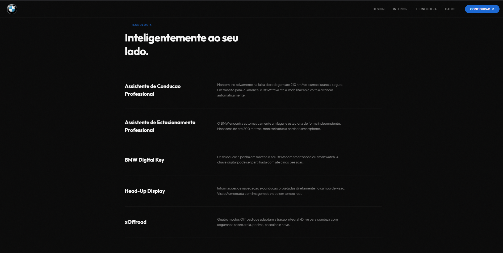
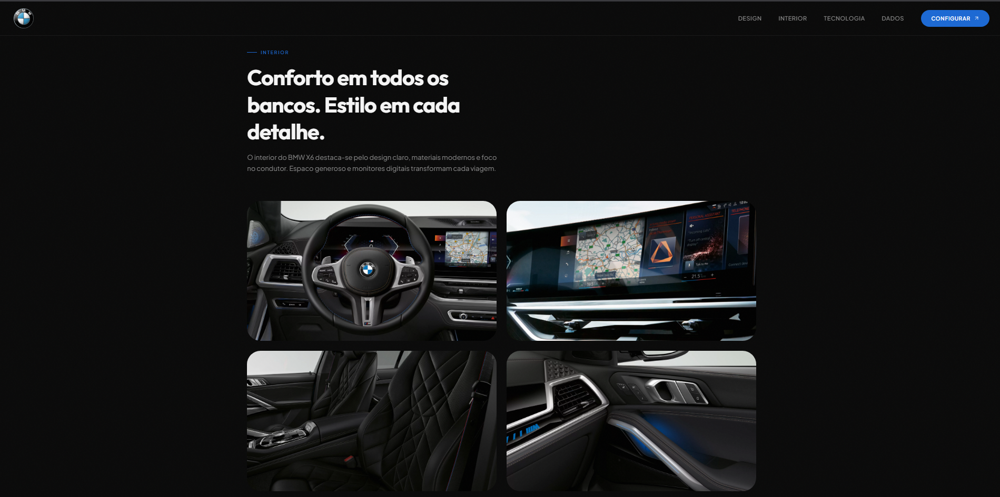
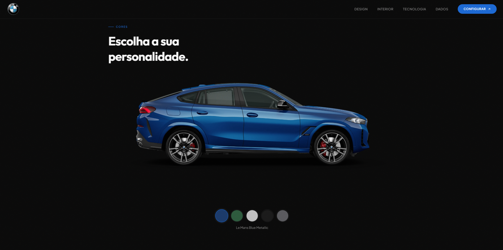
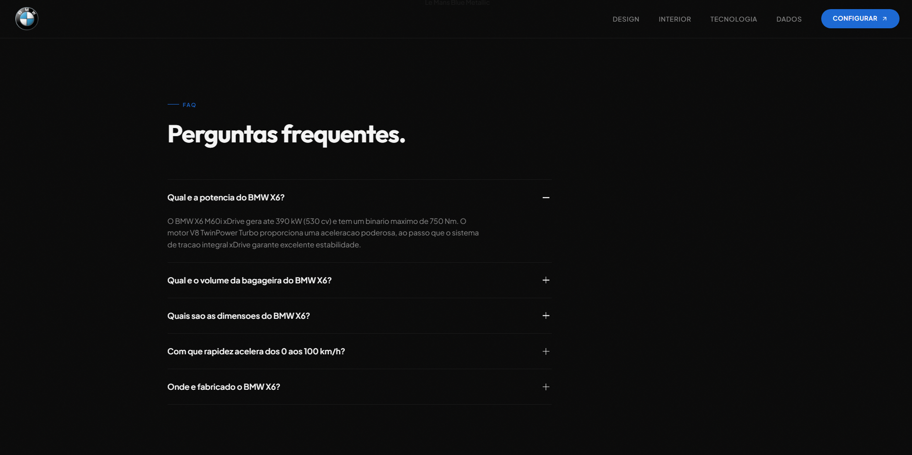

# BMW X6 M60i xDrive — Landing Page

  Uma landing page premium desenvolvida com Next.js 16, TypeScript e Tailwind CSS 4, apresentando o BMW X6 M60i xDrive
  com animações de scroll, vídeo interativo e design responsivo.

  
  🔗 **[Ver projeto ao vivo](https://erikeliasv.github.io/bmw-x6-landing/)**

  ---

  ## Visão Geral

  Landing page single-scroll que simula a experiência de um site oficial BMW, com foco em performance visual, animações
  fluidas e apresentação detalhada do veículo.

  ### Screenshots

  | Seção | Preview |
  |-------|---------|
  | Hero com vídeo scroll-scrub |  |
  | Estatísticas animadas |  |
  | Design exterior |  |
  | Grid de funcionalidades |  |
  | Showcase interior |  |
  | Seletor de cores |  |
  | FAQ accordion |  |


  ---

  ## Funcionalidades

  - **Hero com vídeo interativo** — o vídeo avança conforme o scroll do utilizador, com barra de progresso e botões CTA
  com fade-out
  - **Contadores animados** — 530cv, 750Nm, 4.3s e V8 Bi-Turbo com animação progressiva ao entrar no viewport
  - **Design exterior** — imagem com zoom no hover e descrição detalhada
  - **Grid de funcionalidades** — Pack Desportivo M Pro, jantes de 22" e escape M Sport em layout com card destaque
  - **Showcase interior** — 4 cards com revelação de texto no hover (volante M, curved display, bancos M, Bowers &
  Wilkins)
  - **Seção de tecnologia** — Driving Assistant, Parking Assistant, Digital Key, Head-Up Display, xOffroad
  - **Seletor de cores** — 5 cores com transição fade na preview (Le Mans Blue, Verde Isle of Man, Cinza Frozen Pure,
  Preto Carbon, Cinza Brooklyn)
  - **FAQ accordion** — perguntas frequentes com expansão suave
  - **CTA** — links para o configurador BMW e formulário de proposta
  - **Navbar responsiva** — menu hamburger mobile, smooth scroll entre seções e efeito sticky
  - **Tema dark/light** — suporte via CSS custom properties e `prefers-color-scheme`
  - **Scroll reveal** — animações fade-up com Intersection Observer

  ---

  ## Tecnologias

  | Tecnologia | Versão |
  |------------|--------|
  | Next.js | 16.2.1 |
  | React | 19.2.4 |
  | TypeScript | 5+ |
  | Tailwind CSS | 4 |
  | ESLint | 9+ |
  | React Compiler (Babel) | 1.0.0 |

  ---

  ## Como Executar

  ```bash
  # Clonar o repositório
  git clone https://github.com/ErikEliasV/bmw-x6-landing.git

  # Entrar na pasta do projeto
  cd bmw-x6-landing

  # Instalar dependências
  npm install

  # Rodar em modo de desenvolvimento
  npm run dev

  Acesse http://localhost:3000 no navegador.

  Outros comandos

  # Build de produção
  npm run build

  # Iniciar servidor de produção
  npm start

  # Executar lint
  npm run lint

  ---
  Estrutura do Projeto

  bmw-x6-landing/
  ├── public/
  │   ├── logo.png
  │   └── video-hero.mp4
  ├── src/
  │   ├── app/
  │   │   ├── globals.css
  │   │   ├── layout.tsx
  │   │   └── page.tsx
  │   └── components/
  │       ├── BmwLogo.tsx
  │       ├── CTASection.tsx
  │       ├── ColorSelector.tsx
  │       ├── DesignSection.tsx
  │       ├── FAQ.tsx
  │       ├── FeaturesGrid.tsx
  │       ├── Footer.tsx
  │       ├── HeroVideo.tsx
  │       ├── InteriorShowcase.tsx
  │       ├── Navbar.tsx
  │       ├── ScrollReveal.tsx
  │       ├── StatsStrip.tsx
  │       └── TechSection.tsx
  ├── package.json
  ├── tsconfig.json
  ├── next.config.ts
  └── tailwind / postcss / eslint configs
```
  ---
  ## Preview Completa

  .

  ---
  Autor

  ## Desenvolvido por Erik Elias

  ---
  ## Licença

  Este projeto é apenas para fins educacionais e de portfólio. BMW, o logotipo BMW e X6 são marcas registradas da BMW
  AG. As imagens do veículo são propriedade da BMW AG e são carregadas diretamente dos CDNs oficiais.

  ---
